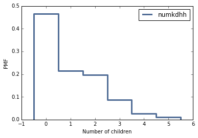
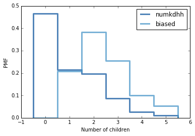

[Think Stats Chapter 3 Exercise 1](http://greenteapress.com/thinkstats2/html/thinkstats2004.html#toc31) (actual vs. biased)

```python
# Load the data
resp = nsfg.ReadFemResp()

# Create a Probability Mass Function
pmf = thinkstats2.Pmf(resp.numkdhh, label='numkdhh')

# Create a plot of the Probability Mass Function
thinkplot.Pmf(pmf)
thinkplot.Config(xlabel='Number of children', ylabel='PMF')
```



Plot shows that number of children under 18 in the respondents' households is mostly 0.
Now compute the biased distribution. 
```python
# This function computes the biased PMF
def BiasPmf(pmf, label):
    new_pmf = pmf.Copy(label=label)

    for num, prob in pmf.Items():
        new_pmf[num] = num*prob
        
    new_pmf.Normalize()
    return new_pmf
    
# Create a biased Probability Mass Function
biased = BiasPmf(pmf, label='biased')

# Create a plot of the actual and biased Probability Mass Function
thinkplot.PrePlot(2)
thinkplot.Pmfs([pmf, biased])
thinkplot.Config(xlabel='Number of children', ylabel='PMF')

# Compute the mean of actual ans biased distributions
print("Mean of actual distribution:", pmf.Mean()) 
print("Mean of biased distribution:", biased.Mean())
```



Mean of actual distribution: 1.0242051550438309
Mean of biased distribution: 2.4036791006642821

Biased distribution has a larger mean than the actual as the actual distribution has a mean of 1.02 children and biased distribution has a mean of 2.4 children. This might be the result of families with no children have no chance to be in the sample.
