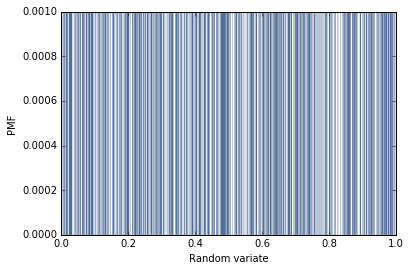

[Think Stats Chapter 4 Exercise 2](http://greenteapress.com/thinkstats2/html/thinkstats2005.html#toc41) (a random distribution)


This question asks to verify that numbers generated by using random.random are uniform between 0 and 1.
In order to verify this, examine the pmf and cdf. 
```python
# Generate 1000 numbers by using random.random	
t = np.random.random(1000)

# Plot pmf
pmf = thinkstats2.Pmf(t)
thinkplot.Pmf(pmf, linewidth=0.1)
thinkplot.Config(xlabel='Random variate', ylabel='PMF')
```


This plot has many discrete values and hard to interpret. Pmfs work well if the number of value is small. But as the number of values increases, the effect of random noise increases.


```python
# Plot cdf
cdf = thinkstats2.Cdf(t)
thinkplot.Cdf(cdf)
thinkplot.Config(xlabel='Random variate', ylabel='CDF')
```


According to this plot the CDF is  a straight line, which means that the distribution is uniform.
